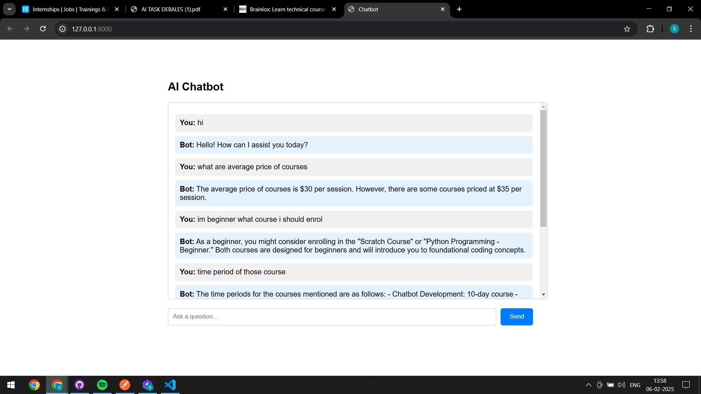

# Langchain-Brainlox

Langchain-Brainlox is a FastAPI-based application that leverages Langchain and OpenAI to provide a question-answering (QA) service using embeddings and vector stores.<br><br>
<h3>Note:</h3> This Model is trained on https://brainlox.com/ with 70+ sub pages, the accuracy of the data is somewhat alright, in future we can improve it.

## Demo Screenshot


## Project Structure

```
Langchain-Brainlox/
├── __pycache__/
├── .env
├── .gitattributes
├── .gitignore
├── app.py           # FastAPI application
├── dataIngest.py   # Data ingestion script
├── faiss_index/    # Vector store directory
│   ├── index.faiss
│   └── index.pkl
├── index.html      # Frontend interface
├── README.md
├── requirements.txt
└── venv/
    ├── Include/
    ├── Lib/
    ├── Scripts/
    └── ...
```

## Setup

1. **Clone the repository:**
    ```sh
    git clone https://github.com/yourusername/Langchain-Brainlox.git
    cd Langchain-Brainlox
    ```

2. **Create and activate a virtual environment:**
    ```sh
    python -m venv venv
    source venv/bin/activate  # On Windows use `venv\Scripts\activate`
    ```

3. **Install the dependencies:**
    ```sh
    pip install -r requirements.txt
    ```

4. **Set up environment variables:**
    Create a `.env` file in the root directory and add your OpenAI API key:
    ```
    OPENAI_API_KEY=your_openai_api_key
    ```

## Data Ingestion

To ingest data and create the FAISS index, run the `dataIngest.py` script:
```sh
python dataIngest.py
```

## Running the Application

To start the FastAPI application, run the `app.py` script:
```sh
python app.py
```

The application will be available at `http://localhost:8000`.

## Features

- Interactive chat interface
- Vector store-based document retrieval
- Integration with OpenAI's GPT models
- Real-time response streaming
- Responsive web design

## API Endpoints

### POST /chat

**Description:** Accepts a JSON payload with a `query` field and returns a response from the QA model.

**Request:**
```json
{
    "query": "Your question here"
}
```

**Response:**
```json
{
    "response": "Answer from the model"
}
```

## License

This project is licensed under the MIT License.
